# Cognito LMS

**An intelligent learning management system built on directed acyclic graph (DAG) course dependencies, AI-assisted tutoring, and algorithmic study scheduling.**

---

## ■ Overview

Cognito is a full-stack LMS that goes beyond content hosting. It models course dependencies as a DAG with enforced acyclicity, runs a 2-layer search engine (in-memory Trie with AI semantic fallback), generates personalized study schedules via a greedy first-fit algorithm, and provides an AI tutor with full course-context awareness through a Retrieval-Augmented Generation (RAG) pipeline.

The platform handles the complete learning lifecycle: course discovery in a marketplace, enrollment with async notification, video-based lessons with integrated code labs, quiz assessment, certificate generation with public verification, and student progress analytics.

---

## ■ Demo

`[Demo Video Placeholder]`

---

## ■ Tech Stack

| Layer | Technology |
|-------|-----------|
| **Frontend** | React 19, Vite 7, Redux Toolkit, React Router 7, Tailwind CSS 3.4 |
| **Backend** | Django 6, Django REST Framework 3.16, Simple JWT |
| **Database** | SQLite (dev), PostgreSQL (prod) |
| **Caching** | Redis via django-redis |
| **Async** | Celery 5 with Redis broker |
| **AI/LLM** | Ollama (Llama 3, local inference) |
| **Code Execution** | Piston API (sandboxed, proxied through backend) |
| **Visualization** | React Flow (DAG), Monaco Editor (code lab), Recharts (analytics) |
| **Documents** | ReportLab (PDF certificates), qrcode (QR generation) |

### Documentation

| Document | Scope |
|----------|-------|
| [Frontend README](cognito-frontend/README.md) | Component architecture, state management, API layer, skeleton loading |
| [Backend README](backend/README.md) | API endpoint reference, data models, algorithms, Celery tasks, test coverage |

---

## ■ System Architecture

### High-Level Request Flow

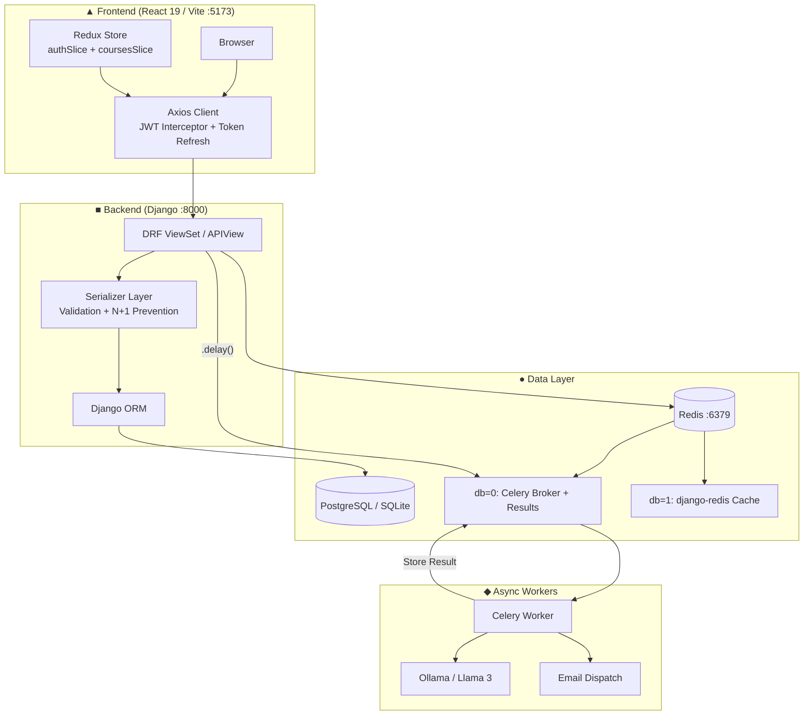

### Database Schema

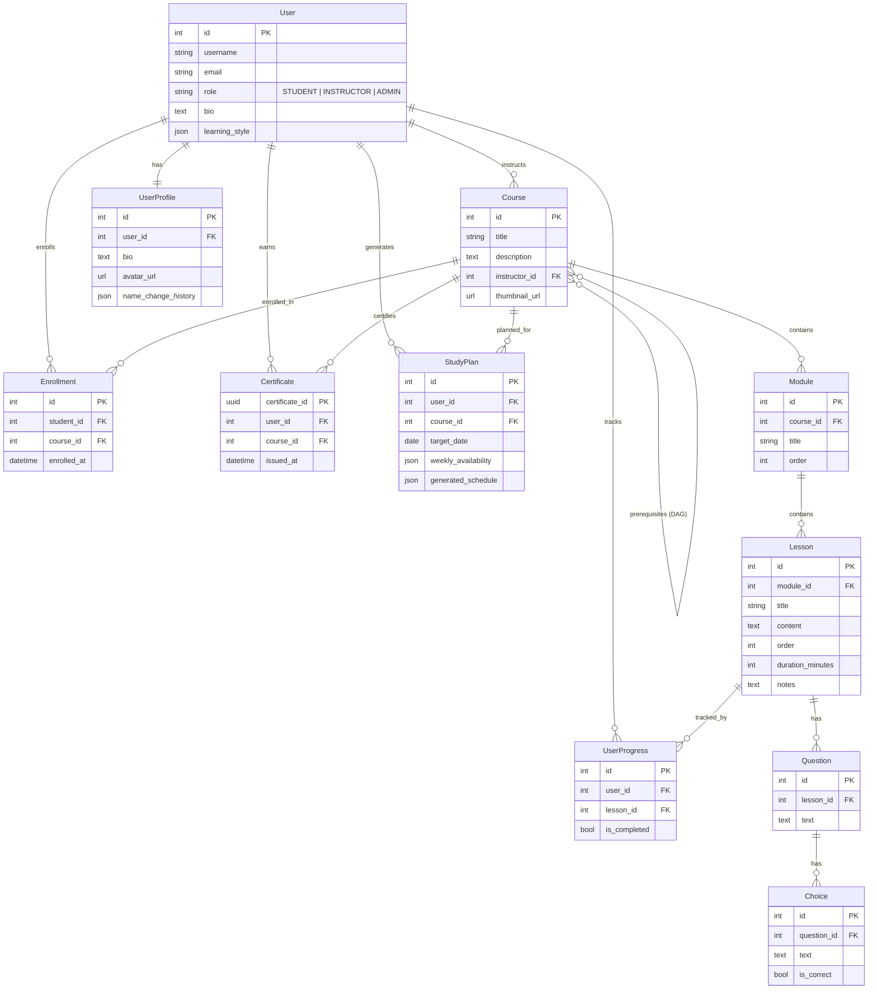

### Search Architecture (2-Layer Pipeline)

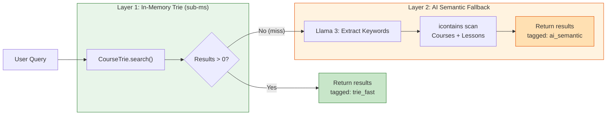

### DAG Validation Flow

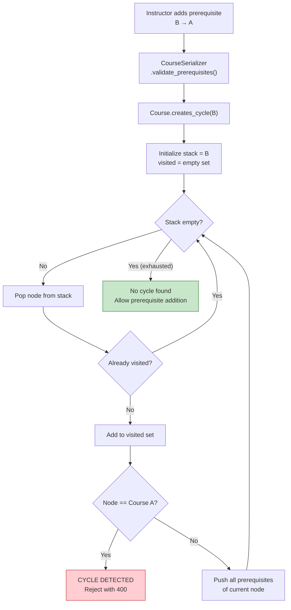

### RAG Context Builder (`services.py`)

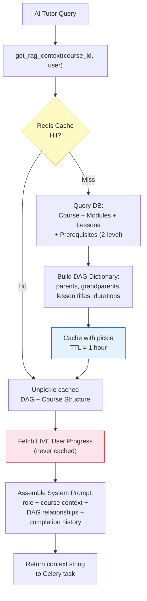

### Study Scheduler (Greedy First-Fit Algorithm)

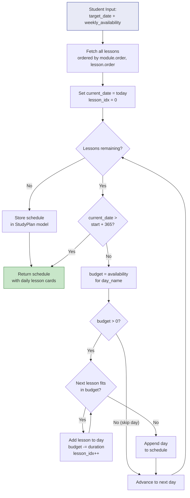

### Certificate Generation and Verification

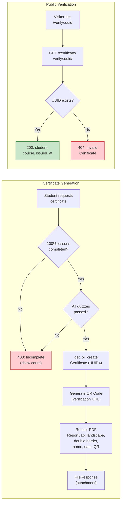

### AI Tutor Interaction Lifecycle

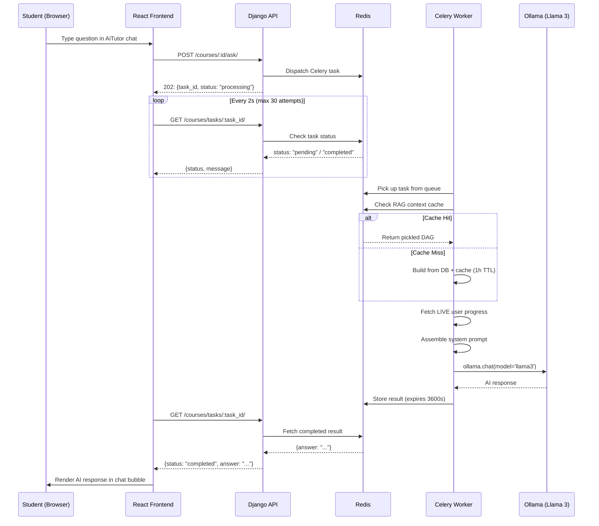

---

## ■ Architecture Workflow (User Journey)

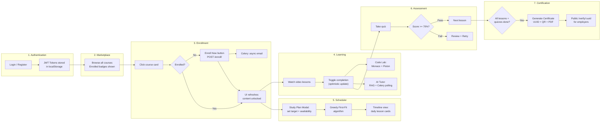

### 1. Landing and Authentication

A visitor arrives at the platform and is presented with login or registration. Authentication uses JWT with automatic token refresh. Tokens persist in `localStorage`; the Axios interceptor transparently refreshes expired access tokens using the refresh token.

### 2. Course Marketplace

After login, the student navigates to `/browse` to see all available courses in a grid. Each card displays the title, description, instructor name, and an "Enrolled" badge if the student is already registered. The marketplace is accessible to both authenticated and unauthenticated users.

### 3. Enrollment

Clicking a non-enrolled course opens the detail page with locked content (video URLs stripped, sidebar lessons disabled, Code Lab tab hidden). The "Enroll Now" button triggers a POST to the enrollment endpoint. Celery dispatches an async enrollment email. The UI instantly refreshes to show unlocked content without a full page reload.

### 4. DAG Visualization

The "Prerequisites" tab renders a React Flow graph. Enrolled users see an interactive 3-level DAG (grandparents, parents, current course). Non-enrolled users see a simplified prerequisite list. Edges are animated with directional arrows.

### 5. Study Scheduler

The student opens the Study Plan modal, sets a target completion date, and adjusts per-day availability (in minutes). The greedy algorithm allocates lessons across available days. Results appear as a vertical timeline with per-day lesson cards showing titles and durations.

### 6. AI Tutor

From the course detail page, the student opens the "Coding Lab and AI" tab. The AI tutor chat panel uses RAG: it pre-loads the full course structure, DAG relationships, and the student's completion history. Queries are processed asynchronously via Celery with 2-second polling on the frontend. Responses appear in a chat interface with copy-to-clipboard support.

### 7. Code Lab

The integrated Monaco Editor provides a VS Code-like environment. Code execution routes through the backend proxy to the Piston API, with rate limiting and 30-second timeout protection. Output appears in a terminal panel below the editor.

### 8. Certificate Generation

Once a student completes all lessons and passes all quizzes, they can request a certificate. The system verifies 100% completion, mints a UUID-keyed certificate, generates a QR code encoding the verification URL, and renders a PDF with ReportLab (landscape format, double border, instructor and date).

### 9. Public Verification

Anyone with the certificate URL can verify it without authentication. The frontend displays the student name, course title, issue date, and a "Verified Credential" badge on success, or an "Invalid Certificate" message with the attempted UUID on failure.

---

## ■ Core Engineering Highlights

### ● DAG with Cycle Detection (Acyclic Enforcement)

Course prerequisites form a directed graph where cycles would create impossible completion paths. The `Course.creates_cycle()` method uses iterative DFS (no recursion, stack-safe for deep graphs) to traverse from a candidate prerequisite back through its ancestors. If the traversal reaches the source course, the edge is rejected at the serializer validation layer. The self-referential M2M field uses `symmetrical=False` to enforce directionality. Time complexity: O(V + E).

### ● Greedy Study Scheduler

The scheduler implements a First-Fit Decreasing bin-packing variant. Lessons are processed in module/lesson order. For each calendar day between now and the target date, the algorithm fills available minutes with lessons until the next lesson exceeds remaining capacity, then advances to the next day. A 365-day safety ceiling prevents infinite loops. The result is stored in `StudyPlan.generated_schedule` as a JSON array for stateless retrieval.

### ● 2-Layer Search (Trie + AI Fallback)

The Trie is built at server startup from all course and lesson titles. Each `TrieNode` uses `__slots__` for memory efficiency, storing children and a list of associated data payloads. Search is case-insensitive and prefix-based, delivering sub-millisecond lookups from RAM with zero network overhead. When the Trie returns no results, the system falls back to Llama 3, which extracts search keywords from the natural-language query. These keywords drive `icontains` queries against the database. Results from each layer are tagged with their source for frontend badge rendering.

### ● Redis + Celery Async Orchestration

Redis serves dual roles: as Celery's message broker (db=0) and as a Django cache backend (db=1). AI queries are offloaded to Celery workers to avoid blocking request threads. The frontend polls task status every 2 seconds with a 60-second hard timeout. Enrollment emails are dispatched asynchronously. Celery results expire after 3600 seconds to prevent Redis memory bloat.

### ● Transient Caching (RAG Context)

The RAG context builder splits data into cacheable (course structure, DAG relationships: 1-hour TTL) and non-cacheable (user progress: always live) layers. Cache keys are per-course. The `CourseDetailView` proactively warms the cache when a student opens a course page, ensuring the first AI query experiences a cache hit. Serialization uses `pickle` to support complex nested dictionaries.

### ● In-Memory Trie (RAM-Resident Search)

The Trie lives entirely in process memory, providing the fastest possible lookup latency (no network hop, no serialization). It is built once at Django startup from the database via `apps.py`, guarded against double-loading during the Vite reloader, and skips initialization during migration commands. This design is intentional: a Redis-backed alternative would add ~0.5ms network latency per lookup and require serialization on every query, negating the purpose of a Trie data structure. The one-time O(N) startup rebuild cost is negligible compared to the runtime performance advantage.

### ● Course Marketplace Architecture

The marketplace serves two audiences from a single API endpoint. For unauthenticated users, all courses are returned with basic metadata. For authenticated users, the serializer annotates each course with `is_enrolled` status by checking the `Enrollment` table. The frontend renders conditional badges and CTAs based on this flag.

### ● Learning Library (Sorted by Last Edited)

The student dashboard fetches enrolled courses ordered by `enrollment.enrolled_at` (most recent first), functioning as a "last touched" sort. This prioritizes actively studied courses at the top. Each course card shows completion progress computed as `(completed_lessons / total_lessons) * 100`.

### ● UUID-Based Certificate System

Certificates use `uuid.uuid4()` as their primary key, preventing sequential enumeration attacks on the public verification endpoint. The certificate object is idempotent via `get_or_create`, ensuring a student receives the same UUID if they re-request a certificate. The PDF includes a QR code that encodes the full verification URL for physical document scanning.

### ● Public Certificate Verification Route

The `/verify/:uuid` route is publicly accessible (no authentication required). The Django view uses `AllowAny` permissions and returns a flat JSON payload `{student, course, issued_at}`. The React component renders three states: loading (spinner), verified (green badge with student/course/date), and invalid (red badge with error message). The route is designed for third-party verification (employers, institutions).

---

## ■ Folder Structure

### Frontend (`cognito-frontend/src/`)

```
src/
  App.jsx                    -- Router config, protected routes, layout
  main.jsx                   -- ReactDOM entry, Redux Provider
  store.js                   -- Redux store (auth + courses reducers)
  index.css                  -- Tailwind directives
  |
  components/ui/
    Button.jsx               -- Reusable styled button
    CodeEditor.jsx           -- Monaco Editor + Piston proxy
    SearchBar.jsx            -- Hybrid search (Trie + AI, debounced)
    Skeleton.jsx             -- Base skeleton primitives
    Skeletons.jsx            -- Page-specific skeleton compositions
    Toast.jsx                -- Toast notification system
  |
  features/auth/
    api/authApi.js            -- login/register API calls
    components/LoginPage.jsx  -- Login form
    components/SignupPage.jsx -- Registration form
    slices/authSlice.js       -- JWT auth state (login, register, logout)
  |
  features/courses/
    api/coursesApi.js         -- Course/AI/enrollment API calls
    components/
      AiTutor.jsx             -- AI chat with async polling
      CourseDetail.jsx         -- Full course view (sidebar, video, tabs)
      CourseGraph.jsx          -- React Flow DAG visualization
      CourseMarketplace.jsx    -- Course grid with enrollment badges
      Dashboard.jsx            -- Enrolled courses + progress carousel
      Quiz.jsx                 -- Quiz taking + results screen
      SettingsModal.jsx        -- Profile editing modal
      StudyPlanModal.jsx       -- Greedy scheduler wizard (3-step)
    pages/
      CertificateVerify.jsx    -- Public certificate verification
      CoursePage.jsx           -- Course detail page wrapper
      ProfilePage.jsx          -- User profile + stats
    slices/coursesSlice.js     -- Course list + detail state
  |
  hooks/
    useDebounce.js             -- Input debouncing hook (300ms)
  |
  lib/
    axios.js                   -- Axios client with JWT interceptors
    toastEvents.js             -- Pub/sub event emitter for toasts
```

### Backend (`backend/`)

```
backend/
  manage.py                  -- Django management entry
  |
  mysite/
    __init__.py              -- Celery app auto-import
    celery.py                -- Celery configuration
    urls.py                  -- Root URL routing
    asgi.py / wsgi.py        -- ASGI/WSGI entry points
    settings/
      __init__.py            -- Environment-based settings selector
      base.py                -- Shared config (JWT, Redis, Celery, DRF)
      dev.py                 -- Development overrides (SQLite, DEBUG)
      prod.py                -- Production overrides (PostgreSQL, HSTS)
  |
  users/
    models.py                -- Custom User (AbstractUser + role enum)
    serializers.py           -- Registration serializer
    views.py                 -- RegisterView (AllowAny)
    admin.py                 -- User admin configuration
  |
  courses/
    models.py                -- Course, Module, Lesson, Question, Choice,
    |                           Enrollment, UserProgress, Certificate,
    |                           StudyPlan, UserProfile (10 models)
    views.py                 -- 18 API endpoints (ViewSets + APIViews)
    serializers.py           -- Nested serializers with N+1 prevention
    services.py              -- RAG context builder (Redis + DB hybrid)
    utils.py                 -- CourseTrie, generate_study_schedule
    tasks.py                 -- Celery tasks (AI response, email)
    ai_client.py             -- Ollama/Llama 3 integration
    apps.py                  -- Trie initialization at startup
    urls.py                  -- URL patterns for all course endpoints
    admin.py                 -- Course/Module/Lesson admin
    tests.py                 -- 412-line test suite (10 test classes)
    management/commands/     -- Custom management commands
```

---

## ■ Installation Guide

### Prerequisites

- Python 3.11+
- Node.js 18+
- Redis 7+
- Ollama (for AI features)

### Backend Setup

```bash
# Clone and enter project
git clone <repository-url>
cd Cognito-LMS

# Create virtual environment
python -m venv venv
source venv/bin/activate

# Install dependencies
pip install -r requirements.txt

# Create environment file
cat > backend/.env << EOF
SECRET_KEY=your-secret-key-here
REDIS_URL=redis://localhost:6379/0
DJANGO_SETTINGS_MODULE=mysite.settings.dev
EOF

# Run migrations
cd backend
python manage.py migrate

# Create superuser
python manage.py createsuperuser

# Start development server
python manage.py runserver
```

### Redis Setup

```bash
# macOS
brew install redis
brew services start redis

# Verify
redis-cli ping  # Should return PONG
```

### Celery Worker Setup

```bash
# In a separate terminal, from /backend
celery -A mysite worker --loglevel=info
```

### Ollama Setup (AI Tutor)

```bash
# Install Ollama
curl -fsSL https://ollama.com/install.sh | sh

# Pull the model
ollama pull llama3

# Verify
ollama run llama3 "Hello"
```

### Frontend Setup

```bash
# From project root
cd cognito-frontend

# Install dependencies
npm install

# Start development server
npm run dev
```

The frontend runs on `http://localhost:5173` and proxies API calls to `http://localhost:8000`.

### Environment Variables Reference

| Variable | Required | Default | Description |
|----------|----------|---------|-------------|
| `SECRET_KEY` | Yes | - | Django cryptographic key |
| `REDIS_URL` | No | `redis://localhost:6379/0` | Redis connection string |
| `DJANGO_SETTINGS_MODULE` | Yes | - | `mysite.settings.dev` or `mysite.settings.prod` |
| `DATABASE_URL` | Prod only | - | PostgreSQL connection string |
| `ALLOWED_HOSTS` | Prod only | - | Comma-separated hostnames |
| `CORS_ALLOWED_ORIGINS` | Prod only | - | Comma-separated frontend URLs |
| `SITE_URL` | No | `http://127.0.0.1:8000` | Base URL for QR codes |

---

## ■ Deployment Architecture

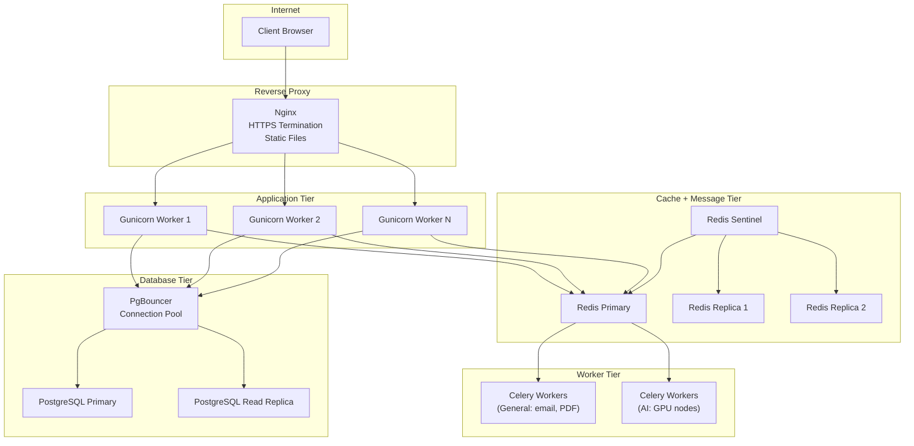

### Scaling Strategy

| Component | Horizontal Strategy |
|-----------|-------------------|
| **Django** | Stateless; scale Gunicorn workers behind Nginx |
| **Redis** | Redis Sentinel or Redis Cluster for HA |
| **Celery** | Separate queues for AI (GPU) vs general (CPU) workers |
| **Database** | Read replicas for dashboard/marketplace queries |
| **Trie** | RAM-resident per process; rebuilt on deploy (sub-second for typical catalogs) |

### Redis Scaling Considerations

Redis db=0 (Celery broker) handles high write throughput from task dispatch. Redis db=1 (cache) handles read-heavy RAG context lookups. In production, separating these into distinct Redis instances prevents cache eviction from starving the broker.

### Database Considerations

`Certificate`, `Enrollment`, and `UserProgress` tables grow linearly with users. The `unique_together` constraints serve as implicit indexes. For large deployments, consider partitioning `UserProgress` by user or adding composite indexes on `(user_id, lesson_id, is_completed)`.

---

## ■ Security Considerations

### Authentication

JWT tokens with 1-day access and 1-day refresh lifetimes. Refresh tokens rotate on every use and old tokens are blacklisted. The Axios interceptor handles silent refresh transparently. Failed refresh clears all stored credentials and redirects to login.

### Certificate Verification Security

Certificates use UUID v4 (122 bits of entropy). The probability of guessing a valid certificate ID is roughly 1 in 5.3 x 10^36. The public verification endpoint returns only `{student, course, issued_at}` -- no sensitive data. The QR code encodes the verification URL, enabling physical document scanning.

### Input Validation

Quiz answers are validated server-side -- the `ChoiceSerializer` strips `is_correct` from all API responses. Course prerequisites are validated against cycle detection before persistence. Profile name changes are rate-limited to 2 per year with an auditable timestamp log stored in `UserProfile.name_change_history`.

### Cache Safety

RAG context cache uses per-course keys, isolating cache entries. User-specific progress is never cached to prevent cross-user data leakage. Cache entries expire after 1 hour (TTL). Celery task results expire after 3600 seconds.

### Production Hardening

The `prod.py` settings enable: HSTS (1 year, preload), secure session and CSRF cookies, `X-Frame-Options: DENY`, browser XSS filter, and content-type nosniff. CORS uses an explicit origin whitelist (no wildcards).

---

## ■ Future Improvements

### Bayesian-GNN Hybrid Failure Predictor

Since the platform already models course dependencies as a DAG, this structure can serve as the backbone for a failure prediction system. The approach involves two layers:

**Layer 1 -- Bayesian Network (Small Data / Cold Start)**: Map quiz failure probabilities onto the existing DAG. Each course node becomes a conditional probability node where `P(fail_course_C | fail_prerequisite_A, fail_prerequisite_B)` is computed from historical quiz data. This works immediately with small datasets because Bayesian networks require only conditional probability tables, not large training corpora. The DAG structure directly provides the network topology -- no structure learning required.

**Layer 2 -- Graph Neural Network (Large Data)**: When sufficient data accumulates (thousands of student trajectories), train a GNN on the same DAG structure. Node features include: quiz scores, time-to-completion, retry count, AI tutor usage frequency. Edge features include: prerequisite completion gap (days between completing prerequisite and starting dependent course). The GNN propagates failure signals through the graph, identifying upstream knowledge gaps that predict downstream failures. This enables preemptive interventions -- the system can recommend revisiting a specific prerequisite before the student fails the dependent course.

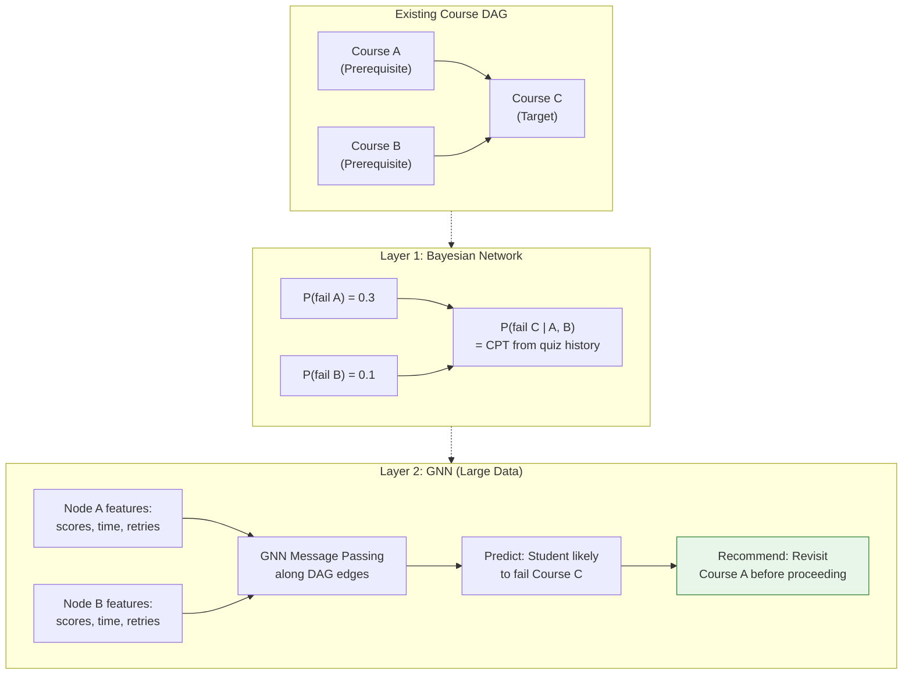

### Additional Technical Improvements

- **WebSocket for AI responses**: Replace polling with WebSocket channels for real-time AI streaming
- **Server-sent events for progress sync**: Broadcast lesson completion across tabs/devices
- **Full-text search**: PostgreSQL GIN indexes to replace `icontains` scans in the AI search fallback
- **Certificate revocation**: Admin endpoint to revoke certificates with revocation status on verification
- **Horizontal Celery routing**: Dedicated GPU worker queue for AI tasks vs CPU queue for email/PDF
- **Materialized views**: Pre-computed dashboard progress aggregates, refreshed on lesson completion
- **Rate limiting per endpoint**: Move from class-level to per-view throttle scopes
- **Audit logging**: Track all grade changes, certificate issuances, and role modifications
- **Offline-first PWA**: Service worker for lesson content caching and offline quiz attempts

---

## ■ Running Tests

```bash
cd backend
python manage.py test courses -v 2
```

The test suite covers 10 test classes across models (DAG cycles, user roles), utilities (Trie search, study scheduler), and API endpoints (CRUD, enrollment, quizzes, profiles, certificates, dashboard, lesson completion).

---

**Built with** Django 6 ▣ React 19 ▣ Redis ▣ Celery ▣ Ollama/Llama 3
