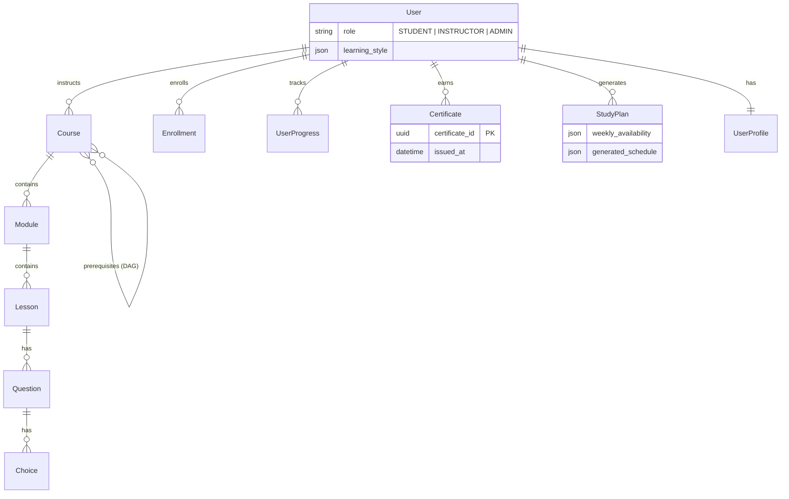

# Cognito LMS -- Backend

Django 6 REST API powering the Cognito learning management system.

---

## ■ Table of Contents
- [Quick Start](#-quick-start)
- [Tech Stack](#-tech-stack)
- [Project Structure](#-project-structure)
- [Data Models](#-data-models)
- [API Endpoints](#-api-endpoints)
  - [Rate Limits](#rate-limits)
- [Core Algorithms](#-core-algorithms)
  - [DAG Cycle Detection](#dag-cycle-detection)
  - [Trie Search](#trie-search)
  - [Greedy Study Scheduler](#greedy-study-scheduler)
  - [RAG Context Builder](#rag-context-builder)
- [Celery Tasks](#-celery-tasks)
- [Settings](#-settings)
- [Environment Variables](#-environment-variables)
- [Testing](#-testing)

---

## ■ Quick Start

```bash
# From project root
cd backend

# Create and activate virtualenv
python -m venv ../venv
source ../venv/bin/activate

# Install dependencies
pip install -r ../requirements.txt

# Configure environment
cp .env.example .env   # Edit with your SECRET_KEY

# Database
python manage.py migrate
python manage.py createsuperuser

# Run
python manage.py runserver      # API on :8000
celery -A mysite worker -l info  # Worker (separate terminal)
```

See the [root README](../docs/README.md) for full setup including Redis and AI provider configuration.

---

## ■ Tech Stack

| Concern | Technology |
|---------|-----------|
| Framework | Django 6.0, DRF 3.16 |
| Auth | Simple JWT 5.5 (access + refresh, rotation, blacklist) |
| Task Queue | Celery 5 (Redis broker, db=0) |
| Cache | django-redis (Redis db=1) |
| AI/LLM | Modular: Ollama (local) or OpenAI (cloud) |
| PDF | ReportLab 4.4 |
| QR | qrcode 8.2 |
| DB | SQLite (dev), PostgreSQL (prod) |

---

## ■ Project Structure

```
backend/
  manage.py
  |
  mysite/                        # Project config
    __init__.py                  # Celery auto-import
    celery.py                    # Celery app
    urls.py                      # Root URL routing
    settings/
      base.py                    # Shared: JWT, Redis, Celery, DRF, throttles
      dev.py                     # DEBUG=True, SQLite, local CORS
      prod.py                    # PostgreSQL, HSTS, secure cookies
  |
  users/                         # Auth app
    models.py                    # User (AbstractUser + role enum)
    serializers.py               # Registration serializer
    views.py                     # RegisterView
  |
  courses/                       # Core app
    models.py                    # 10 models (see schema below)
    views.py                     # 18 API endpoints
    serializers.py               # Nested serializers, N+1 prevention
    services.py                  # RAG context builder
    utils.py                     # CourseTrie, study scheduler
    tasks.py                     # Celery: AI response, email
    ai_client.py                 # Backwards-compat shim (delegates to ai/)
    ai/                          # Modular AI provider package
      __init__.py                # Provider router + public API
      base.py                    # Abstract AIProvider interface
      ollama_provider.py         # Ollama/Llama 3 local inference
      openai_provider.py         # OpenAI cloud inference
      mock.py                    # Shared fallback responses
    apps.py                      # Trie init at startup
    urls.py                      # Course URL patterns
    tests.py                     # 412-line test suite
```

---

## ■ Data Models



**Key constraints**: `unique_together` on `(user, lesson)` for UserProgress, `(user, course)` for Certificate, Enrollment, and StudyPlan.

---

## ■ API Endpoints

| Method | Endpoint | Auth | Description |
|--------|----------|------|-------------|
| POST | `/api/register/` | No | User registration |
| POST | `/api/token/` | No | JWT login (access + refresh) |
| POST | `/api/token/refresh/` | No | Refresh access token |
| GET | `/api/courses/` | Optional | List all courses (+ `is_enrolled` if auth) |
| POST | `/api/courses/` | Yes | Create course |
| GET | `/api/courses/:id/` | Optional | Course detail (locked content if not enrolled) |
| POST | `/api/courses/:id/enroll/` | Yes | Enroll in course (async email via Celery) |
| POST | `/api/courses/:id/ask/` | Yes | Start AI tutor task (returns `task_id`) |
| GET | `/api/courses/tasks/:id/` | Yes | Poll AI task status |
| POST | `/api/courses/lessons/:id/complete/` | Yes | Toggle lesson completion |
| GET | `/api/courses/lessons/:id/quiz/` | Yes | Get quiz questions (no `is_correct`) |
| POST | `/api/courses/lessons/:id/quiz/submit/` | Yes | Submit and grade quiz |
| GET | `/api/courses/search/?q=` | Yes | Hybrid search (Trie + AI) |
| GET | `/api/courses/dashboard/stats/` | Yes | Dashboard with enrolled courses + progress |
| GET | `/api/courses/profile/` | Yes | User profile + stats |
| PATCH | `/api/courses/profile/` | Yes | Update profile |
| POST | `/api/courses/:id/certificate/generate/` | Yes | Generate PDF certificate |
| GET | `/api/courses/certificate/verify/:uuid/` | No | Public certificate verification |
| POST | `/api/courses/:id/generate-plan/` | Yes | Generate study schedule |
| POST | `/api/courses/execute/` | Yes | Execute code (Piston proxy) |

### Rate Limits

| Scope | Limit |
|-------|-------|
| `user` | 100/hour |
| `ai` | 10/minute |
| `search` | 200/minute |

---

## ■ Core Algorithms

### DAG Cycle Detection

`Course.creates_cycle(candidate)` -- Iterative DFS. Traverses from candidate prerequisite through all ancestors. If the source course is reached, the edge is rejected. O(V + E). Called during serializer validation.

### Trie Search

`CourseTrie` -- In-memory prefix tree built at startup (`apps.py`). Indexes course and lesson titles. `TrieNode` uses `__slots__` for memory efficiency. Case-insensitive, sub-millisecond lookups. Falls back to AI keyword extraction (via active provider) when Trie returns no results.

### Greedy Study Scheduler

`generate_study_schedule()` -- First-Fit bin-packing. Iterates calendar days, fills each day's available minutes with lessons in curriculum order. 365-day safety ceiling. Stores result as JSON in `StudyPlan`.

### RAG Context Builder

`get_rag_context()` -- Two-layer caching:
- **Cacheable**: Course structure + DAG (1h TTL, pickled to Redis)
- **Non-cacheable**: User progress (always live from DB)
- **Proactive warming**: `CourseDetailView` pre-calls on page load

---

## ■ Celery Tasks

| Task | Trigger | Description |
|------|---------|-------------|
| `generate_ai_response_task` | POST `/ask/` | Builds RAG context, calls AI provider, stores result |
| `send_enrollment_email` | POST `/enroll/` | Simulated email dispatch (5s delay) |

---

## ■ Settings

Split settings pattern (`mysite/settings/`):

| File | Purpose |
|------|---------|
| `base.py` | Shared: installed apps, middleware, JWT config, Redis cache, Celery, DRF throttles |
| `dev.py` | `DEBUG=True`, SQLite/PostgreSQL toggle, `localhost` CORS |
| `prod.py` | `DEBUG=False`, PostgreSQL required, HSTS, secure cookies, XSS filter |

Select via `DJANGO_SETTINGS_MODULE`:
```bash
export DJANGO_SETTINGS_MODULE=mysite.settings.dev   # Development
export DJANGO_SETTINGS_MODULE=mysite.settings.prod   # Production
```

---

## ■ Environment Variables

| Variable | Required | Default | Description |
|----------|----------|---------|-------------|
| `SECRET_KEY` | Yes | -- | Django secret key |
| `REDIS_URL` | No | `redis://localhost:6379/0` | Redis connection |
| `DATABASE_URL` | Prod | -- | PostgreSQL URI |
| `ALLOWED_HOSTS` | Prod | -- | Comma-separated hostnames |
| `CORS_ALLOWED_ORIGINS` | Prod | -- | Comma-separated frontend URLs |
| `SITE_URL` | No | `http://127.0.0.1:8000` | Base for QR code URLs |
| `AI_PROVIDER` | No | `ollama` | AI backend: `ollama` or `openai` |
| `AI_MODEL` | No | `llama3` | Model name (e.g. `llama3`, `gpt-4o`) |
| `AI_API_KEY` | If openai | -- | API key for the OpenAI provider |

---

## ■ Testing

```bash
python manage.py test courses -v 2
```

10 test classes (412 lines):

| Class | Coverage |
|-------|----------|
| `CourseModelTest` | DAG cycles: self-ref, direct, deep chain, no false positive |
| `UserModelTest` | Default role, superuser enforcement |
| `TrieTest` | Exact match, prefix, case-insensitive, no match, empty query |
| `StudySchedulerTest` | Allocation, skip days, overflow, empty input |
| `CourseAPITest` | List, create (auth/unauth), detail, enrollment |
| `QuizAPITest` | Fetch (no `is_correct`), correct/wrong grading |
| `ProfileAPITest` | GET profile, PATCH name |
| `CertificateVerifyTest` | Valid UUID (200), invalid (404) |
| `DashboardAPITest` | Enrolled courses, progress updates |
| `LessonCompletionTest` | Toggle on/off |
