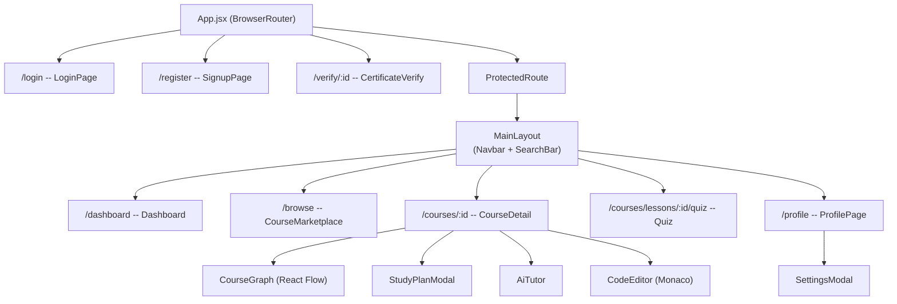

# Cognito LMS -- Frontend

React 19 single-page application for the Cognito learning management system.

---

## ■ Table of Contents
- [Quick Start](#-quick-start)
- [Tech Stack](#-tech-stack)
- [Architecture](#-architecture)
  - [Design Pattern: Feature-Sliced](#design-pattern-feature-sliced)
  - [Component Hierarchy](#component-hierarchy)
  - [State Management](#state-management)
  - [API Layer](#api-layer)
  - [Skeleton Loading](#skeleton-loading)
  - [Search (Frontend)](#search-frontend)
- [Key Components](#-key-components)
- [Environment](#-environment)

---

## ■ Quick Start

```bash
npm install
npm run dev        # http://localhost:5173
npm run build      # Production bundle
npm run preview    # Preview production build
```

Requires the backend running on `http://localhost:8000`. See the [root README](../docs/README.md) for full setup.

---

## ■ Tech Stack

| Concern | Library |
|---------|---------|
| Framework | React 19.2 |
| Build | Vite 7.2 |
| State | Redux Toolkit 2.11 |
| Routing | React Router DOM 7.9 |
| Styling | Tailwind CSS 3.4 |
| HTTP | Axios 1.13 |
| Code Editor | Monaco Editor (React) 4.7 |
| DAG Rendering | React Flow 11.11 |
| Charts | Recharts 3.6 |
| Icons | Lucide React |

---

## ■ Architecture

### Design Pattern: Feature-Sliced

Each domain owns its own `api/`, `components/`, `pages/`, and `slices/` directories. Cross-feature coupling is avoided by keeping all domain logic colocated.

```
src/
  App.jsx               -- Router, protected routes, MainLayout
  main.jsx              -- Entry point, Redux Provider
  store.js              -- configureStore (auth + courses)
  |
  components/ui/        -- Shared UI primitives
  features/auth/        -- Login, register, JWT state
  features/courses/     -- All course-related features
  hooks/                -- Custom hooks (useDebounce)
  lib/                  -- Axios client, toast events
```

### Component Hierarchy



### State Management

Two Redux slices:

| Slice | State | Persistence |
|-------|-------|-------------|
| `authSlice` | `user`, `token`, `isAuthenticated`, `loading`, `error` | `localStorage` (tokens + user) |
| `coursesSlice` | `list`, `currentCourse`, `loading`, `error` | In-memory only |

**Key patterns**:
- `authSlice` hydrates from `localStorage` at startup (session persistence)
- `coursesSlice.toggleLessonCompletion` does optimistic in-store update
- `updateUser` reducer enables instant UI refresh after profile fetch

### API Layer

The Axios client (`lib/axios.js`) implements:

1. **Request interceptor**: Attaches `Bearer` token from `localStorage`
2. **Response interceptor**: On 401, attempts silent refresh via stored refresh token. If refresh succeeds, retries original request. If refresh fails, clears auth and redirects to `/login`.
3. **Toast integration**: Non-401 errors trigger notifications via pub/sub event emitter (`toastEvents.js`), decoupled from React tree.

The AI tutor uses async polling (`coursesApi.js`):
- POST starts Celery task, receives `task_id`
- Polls every 2s, max 30 attempts (60s timeout)
- Progress callback updates loading message in real-time

### Skeleton Loading

Four page-specific skeleton compositions mirror exact target layouts:

| Component | Mirrors |
|-----------|---------|
| `DashboardSkeleton` | Hero carousel + 3-card grid |
| `MarketplaceSkeleton` | Header + 6-card grid |
| `CourseDetailSkeleton` | Sidebar (3x3) + video + controls + notes |
| `ProfileSkeleton` | Header card + 3 stat cards |

### Search (Frontend)

`SearchBar.jsx` implements debounced hybrid search:
- 300ms debounce via `useDebounce` hook
- Calls `/api/courses/search/?q=...`
- Renders results in dark dropdown with source badges (`trie_fast` vs `ai_semantic`)
- Click navigates to course detail

---

## ■ Key Components

| Component | Responsibility |
|-----------|---------------|
| `CourseDetail.jsx` | Sidebar with lock/unlock state, video tab, coding lab + AI tab, DAG tab, study plan |
| `CourseGraph.jsx` | React Flow 3-level DAG (grandparents, parents, target course) |
| `AiTutor.jsx` | RAG-powered chat with Celery polling, copy-to-clipboard |
| `CodeEditor.jsx` | Monaco Editor + Piston backend proxy, terminal output panel |
| `StudyPlanModal.jsx` | 3-step wizard: availability input, loading spinner, timeline results |
| `Quiz.jsx` | Quiz taking with randomized choices, polished result screen (pass/fail) |
| `Dashboard.jsx` | Enrolled courses carousel + progress cards |
| `CourseMarketplace.jsx` | All courses grid with enrollment badges |
| `SearchBar.jsx` | Hybrid Trie + AI search with debounced dropdown |

---

## ■ Environment

No `.env` file needed for the frontend. The Axios base URL defaults to `http://localhost:8000` and is configured in `lib/axios.js`.

For production, update the `baseURL` in `lib/axios.js` or use Vite environment variables:

```bash
VITE_API_URL=https://api.yourdomain.com npm run build
```
